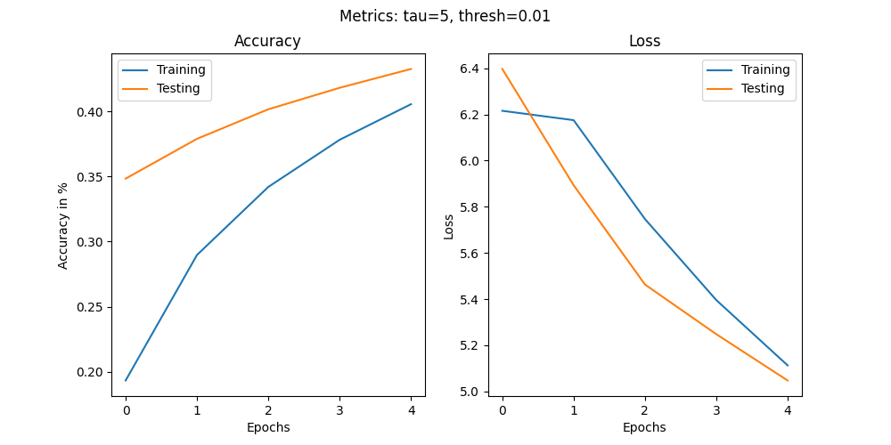
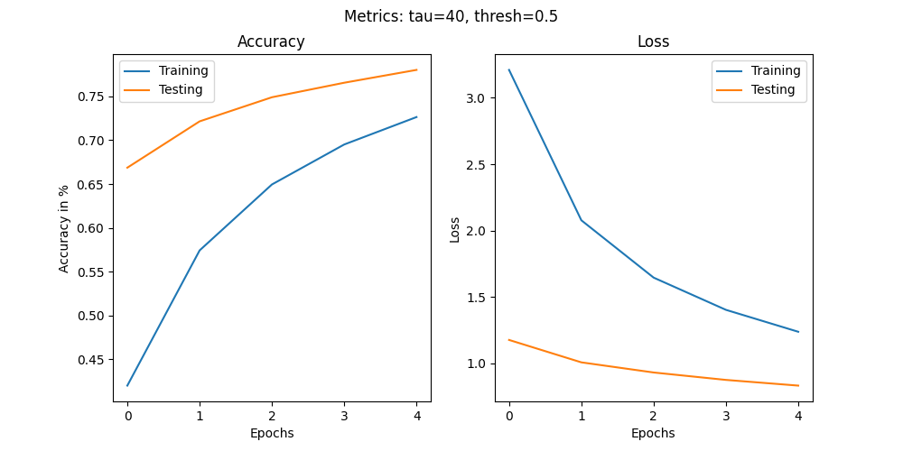

# SSNN-EMNIST

### What does this do?
Using the Extended-MNIST dataset (EMNIST) this SpikingNeuralNetwork predicts mostly the correct class (letter) of the latency-encoded example data.   

### Results
We let the SNN run properly with two different hyperparameter configurations:

### Contributions:
Setting up the dataset and spike encoding (e.g. deciding against rate coding): MeinChef    
Setting up LIF neurons: MeinChef* and Mini11e    
Network related stuff:    
    - Feed Forward: MeinChef* and Mini11e    
    - Train loop: MeinChef    
    - Test loop: Mini11e    
    - Metrics and plotting: Mini11e    
Hyperparameter-Optimisation: MeinChef and Mini11e

*- greater workload